# FO-Quiz-MP2
Formula One Quiz is a quiz for users all levels of knowledge relating to Formula One. The quiz is all things Formula one when it comes to quiz content, style and symbology. The quiz is broken down into 3 sections for users that have limited knowledge (Rookie), those who have a general understanding of Formula One (Seasoned Driver) and Formula One Experts (Expert). It is an interactive quiz with users having a certain amount of time to choose an answer, a Formula One style scoring system has also been implemented. Throughout the site there a subtle features included to give the user an authentic Formula One quiz experience.  

This is Milestone Project 2 for a Level 5 Diploma in Web Application Development. This website features two html pages and is built using technologies that I have learnt since staring the course including HTML, CSS and Javascript.  

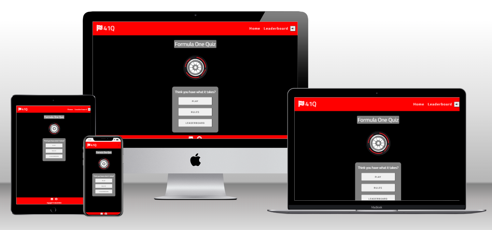  

Link to live site: https://ojalaw.github.io/Formula_One_Quiz_MP2/

## CONTENTS

* [User Experience](#user-experience-ux)
  * [User Stories](#user-stories)

* [Design](#design)
  * [Colour Scheme](#colour-scheme)
  * [Typography](#typography)
  * [Layout](#layout)
  * [Imagery](#imagery)
  * [Wireframes](#wireframes)
  * [Future Updates](#future-updates)

* [Features](#features)
  * [General Features on Every Page](#general-features-on-every-page)
  * [General Features on Individual Pages](#general-features-on-individual-pages)
  * [Future Implementations](#future-implementations)
  * [Accessibility](#accessibility)

* [Technologies Used](#technologies-used)
  * [Languages Used](#languages-used)
  * [Frameworks, Libraries & Programs Used](#frameworks-libraries--programs-used)

* [Testing](#testing)

* [Deployment](#deployment)

* [Credits](#credits)
  * [Code Used](#code-used)
  * [Content](#content)
  * [Media](#media)
  * [Acknowledgments](#acknowledgments)
  
  ---

## User Experience (UX)  

### User Stories

**User Story 1:** 
User new to the Formula one environment and looking to build knowledge and test what I already know about the sport. I want to play a Formula One quiz for all levels of knowledge.

**User Story 2:** 
User who has been exposed to Formula One for last 12 months, I want to test my knowledge but i also want to chalenge myself by playing a quiz that I will find challenging.

**User Story 3:** 
Formula One super fan that has played multiple different Formula One quizes in the past. I want to play a quiz that not only tests and challeneges my knowledge of the sport but also has Formula One animations throughout the site.

**User Story 4:** 
General knowledge quiz enthusiast. I want to play as many quizes as possible, I have a good baseline knowledge of Formula One and i would like to play the quiz on multiple different levels of experience.

## Design  

### Colour Scheme

Initial color scheme is general Dark theme with Black and Grey used for background colors white predominatly used for text and Red used as an accent colour. I have used this to give the site a modern contempary feel, the colour scheme is also similar to that of Formula One and has been used for symbolic purposes.

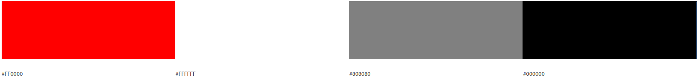

### Typography
This Formula One Quiz utilises One Google Font for Typography, Titillium Web has been used. This font has been chosen because it is the font that has been used by Formula One, this will give users an authentic feel to the quiz, especially users who are familiar with Formula One.

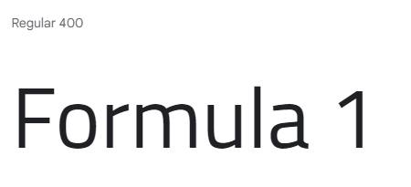

### Layout
I initially intended on using a single HTML page and using DOM manipulation to cycle through the different stages of the quiz and changing the style when appropriate. I have achieved this for the active part of the quiz and added an additional HTML page for the leaderboard which utilises local storage to display users scores.
The interactive part of the quiz that manipulates the DOM can be broken down into 5 key stages before the leaderboard is displayed;

**Intro**  
this is the stage of the quiz where the user can play the quiz, check the rules of the quiz and also check the current leaderboard.

**Difficulty Selection**  
This is the stage of the quiz where the user can choose 1 of three different difficulty levels in the quiz Rookie (easy), Seasoned Driver (medium) or Expert ~(hard).

**Starting Light Procedure**  
This stage of the quiz is an animation used to try and enhance the users experience and bring real life Formula 1 into the quiz.

**The Quiz**  
This is the stage of the quiz where the user is presented with the difficulty level of the quiz that they have selected. Each difficulty level consists of 10 questions, users have 15 seconds per question to answer before the timer runs out. If the timer runs out, the user has automatically recieved an incorrect answer for that question. The user has 4 answers to choose from, once the user has selected an answer, the quiz will load the next question after a short delay. The user will then be notified if they got the answer correct or not and also recieve a feedback message. There is a scoring system for each difficulty level, correct answers will be awarded with 1 point on Rookie difficaulty, 5 points on seasoned driver difficulty and 10 points on expert difficulty.

**Completion**  
Once the quiz is finished, users will be presented with a page that tells the user how much they have scored in the quiz and gives them the option to submit their name to the leaderboard, their is also on option to return to the main menu, in this case, the intro box.

### Symbology  
I have put alot of thought into the symbology of the site. For example, many of the design and animation aspects have been done to closely match what can be seen in Formula One today. As previously mentioned, the gogle font used is the same as in Formula One, the scoring system matches the way that racers are scored. The audio that features throughout the site is very similar to what would be heard during a race day. The starting light procedure proior to the quiz is what one would see prior to a race starting and the displayed score at the end mimics end of race celebrations.

### Accessibility  
The site has scored highly in terms of accessibility, I have included alt text descriptions for all images to provide context and information to visually impaired users.  

### Imagery

I used minimal imagery for my site with the intention to keep it as simplistic as possible. Alos, to really optimise the site with imagery, i would need to use Official F1 imagery which would breach copyright. Images used can be found in the credits.

### Wireframes

[41Q Wireframe](README-images/41Q-wireframe-mk2.pdf "Link to 41Q wireframe")

### Future updates
The are a number of updates i would like to implement in the future. One update that could be included is a light/dark version of the quiz. I would also like to add more Formula 1 related animations, audio and images on the site. In addition, a leaderboard that extends further than local storage and has a database attached to it.

## Features

### General features

**Spinning Tyre**  
I used an image of a Formula 1 car tyre and used CSS to rotate the car clockwise, mimicing an actual Formula 1 car. 

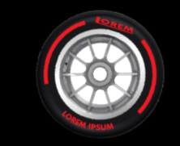

**Mute button**  
I inluded a mute button to give user control of audio that has been included on the site. 

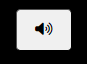

**Starting Light animation/Start Message**  
I included a number of different rectangles and circles and using a combination of CSS/Javascript, managed to create a starting light procedure with associated audio with a start message.

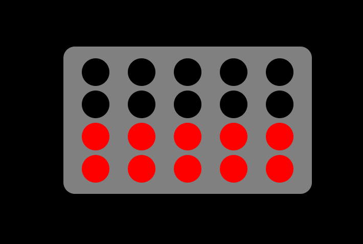

**Question Counter**  
I included a question counter and accomponying progress bar for better user experience. This will count questions up for 1-10 and the progress bar will fill accordingly.

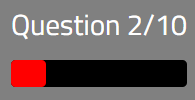

**Timer**  
I included a timer that counts down from 15 with the color changing when the time reaches a certain point. 15-11 is in the color red, 6-10 is the color amber and 5-1 is the color red.

**Score**  
The score counter is as previouslt mentioned, correct answers will be awarded with 1 point on Rookie difficaulty, 5 points on seasoned driver difficulty and 10 points on expert difficulty.

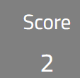

**Correct Answer**  
If users answer a question correctly, they recieve a 'correct answer!' message and a random positive message. The correct answer button will also change color to green.

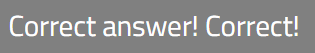

**Incorrect Answer**  
If users answer a question incorrectly, they recieve an 'incorrect answer' message and a random negative message. The selected answer will also change color to red.

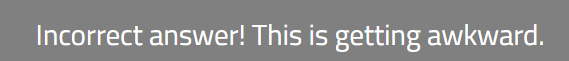

**Quiz End Message**  
If have also added a message to be displayed to the user depending on how well they have done in the quiz. If they scored one of the top 3 scores for that difficulty, it is a congratulatory message, anything else is 'better luck next time'

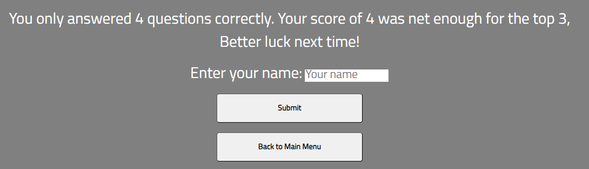

**Leaderboard**  
I have given users the option of entering their name so that they can be displayed on a leaderboard on their local storage.

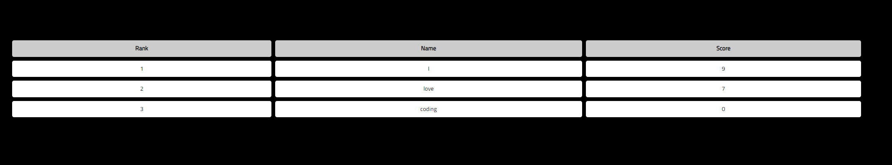

**Audio**  
I have used various different audio. 
I used 'beeping' audio to simulate startling light procedure. Feedback audio depending on whether the answer was correct or not. A correct answer will play an impact wrench audio which is widely used in Formula 1, an incorrect answer will result in the generic 'incorrect answer' buzz. Also, If the user recieves a congratulatory message at the end of the quiz, they will be presented with a crowd cheering, if it is a 'better luck next time' message, they will be presented with a sad sounding trumpet.  

### Future Implementations

Disable site for users with small screen width, prompt them to rotate device to horizontal for better UX.

## Technologies Used

### Languages Used

**HTML5**  
Used for creation of markup for the website content.  
**CSS**  
Cascading style sheets used to style the individual pages.  
**Javascript**  
Scripting language used to make aspects of the site interactive.

### Frameworks, Libraries & Programs Used

[Bootstrap 5.3.0](https://getbootstrap.com/)  
Bootstrap was used to assist with the responsiveness and styling of the website.

[jQuery](https://jquery.com/)  
jQuery came with Bootstrap to make the navbar responsive.

[CDN jsdelivr](https://www.jsdelivr.com/)  
CDN jsdeliver was used to serve static assets bootstrap and jquery to improve performance and reliability.

[Google Fonts](https://fonts.google.com/)  
Google fonts were used to import Lato and Roboto fonts which is used on all pages throughout the project.

[Font awesome](https://fontawesome.com/)  
Font Awesome was used on all pages throughout the website to add icons for aesthetic and UX purposes.

[Github](https://github.com/)   
GitHub is used to store the projects code after being pushed from Git.

[Drawio](https://draw.io)  
Drawio was used to create the wireframes during the design process.

[Visual Studio Code](https://code.visualstudio.com/download)  
Visual Studio Code was use to create files pages and where i produced the code for the project.

[Compressor.io](https://compressor.io)  
Compressor.io was used to reduce the size of images, this was recommended during validation.

[Canva](https://www.canva.com/en_gb/)  
Canva design tool was used to edit the image of the tyre for the spinning tyre animation. 

[Google Chrome Dev Tools](https://developer.chrome.com/docs/devtools/)    
Google Chrome Dev Tools was used during the testing phase to test the responsiveness of the site and to check for any bugs.

[Shutterstock](https://www.shutterstock.com/), [AdobeStock](https://stock.adobe.com/uk/) and [Pixabay](https://pixabay.com/)  

[W3schools](https://www.w3schools.com/)    
W3schools was used to source javascript for my site and for certain CSS aspects (mentioned below).

[PageSpeed Insights](https://pagespeed.web.dev/)   
PageSpeed Insights was used as a backup to Google Chrome Dev tools when lighthouse testing my site.  

## Testing 

Testing process can be found [here](https://github.com/ojalaw/Formula_One_Quiz_MP2/blob/main/TESTING.md)

## Deployment

**How was this site deployed?**

The website was initially deployed on GitHub pages.

**Deploying on GitHub Pages**  
To deploy the website on GitHub Pages, the following steps were followed:

**Create a new repository on GitHub**  
- Add the necessary files to the repository.
- Go to the settings page of the repository, located on the menu bar towards the top of the page, scroll down to the GitHub Pages section which is located at the bottom of the 'Code and automation' sub-section.
- Select the main branch and the root folder, then click save.
- The website will now be live at the URL provided in the GitHub Pages section.

**How to clone the repository**

- Go to the ###  repository on GitHub.
- Click the "Code" button to the right of the screen, click HTTPs and copy the link there.
- Open a GitBash terminal and navigate to the directory where you want to locate the clone.
- On the command line, type "git clone" then paste in the copied url and press the Enter key to begin the clone process.  

**How to Fork the repository**  

- Go to the ### repository on GitHub.
- Click on the 'Fork' option towards the top left of the page.  
- Click the dropdown button and click 'create a new fork'.  
- This will bring up a page with details of the repository, fill in boxes as required.
- Click 'create fork'.  

For further guidance [click here](https://docs.github.com/en/get-started/quickstart/fork-a-repo)  

Forking this repository will allow changes to be made without affecting the original repository.

## Credits

### Code Used

Bootstrap v5.3.0

Code Institute training material

**Javascript**  

**CSS**  

### Content

###  Media

**Images**  
All images used in the site were from shutterstock and can be found below.  
Shutterstock - photo of young racer on a cardboard racing car - 552230137 - Babich Alexander  
Shuterstock - Go karting - 400812964 - makalex69  
Shutterstock - F1 Driver celebrating - 2226240731 - Supamotionstock.com  
Shutterstock - Tyre - 2286386571 - Cesar Mendez

**Audio**  
All audio used in the site were from epidemic sound and can be found below.  

beep.mp3 - beep single 11 - Epidemicsound.com  
betterlucknexttime.mp3 - Trumpet Sad - Epidemicsound.com  
congratulations.mp3 - Human Crowd Studio 7 - Epidemicsound.com  
correct.mp3 - Impact Wrench 20 - Epidemicsound.com  
incorrect.mp3 - Game Show Buzzer 1 - Epidemicsound.com  
start.mp3 - Pontiac Grand Prix 4 - Epidemicsound.com  

  
###  Acknowledgments

Code Institute training material  

