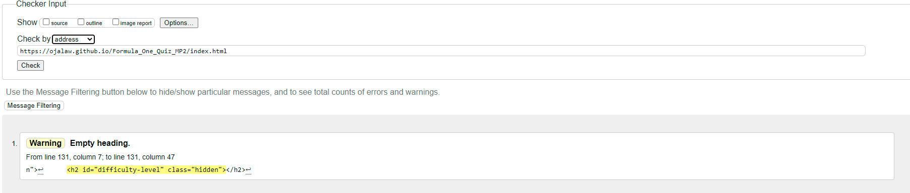
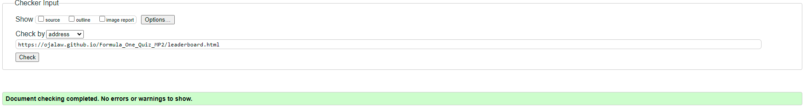
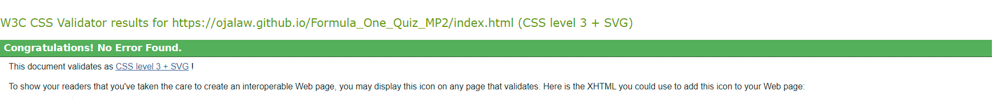
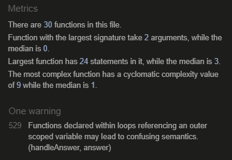
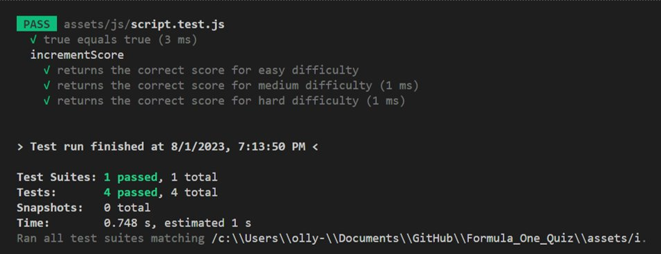

# Testing

## Contents

This site has been tested using the following testing procedures

* [Code Validation](#Code-validation)  

* [Lighthouse Testing](#Lighthouse-Testing)

* [Browser Compatibility](#Browser-Compatibility)

* [Manual Testing](#Manual-Testing)

* [Bug Reporting](#Bug-Reporting)

## Code Validation  

The site was run through both W3C and W3C CSS validators.  

  

The validator showed one warning for the index.html, the reason for this was that the valdidation checker would not know that I am dynamically changing the h2 element based on what difficulty level the user has selected.  

  

The validator showed no such warning for the leaderboard.html page.  

  

There were no warnings for the css file.  

  

There was one warning went the script.js file was run through jshint validator. However, the warning does not impact the quiz logic and was tested extensively to ensure it does not have an impact on the site.  

## Lighthouse Testing  

I used lighthouse testing via Google Chrome Developer Tools and PageSpeed Insights.

The site is tested against the following criteria;

Performance
Accessibility
Best Practices
Search Engine Optimization

**Index**  

- Index desktop lighthouse score [here](README-images/index-desktop-lighthouse.png "Optional title")  
- Index mobile lighthouse score [here](README-images/index-mobile-lighthouse.png "Optional title")  

**Leaderboard**  

 - Leaderboard desktop lighthouse score [here](README-images/leaderboard-desktop-lighthouse.png "Optional title")  
 - Leaderboard mobile lighthouse score [here](README-images/leaderboard-mobile-lighthouse.png "Optional title") 

## Browser Compatibility 
  
**Desktop**  
| Browser            | Version                                               | Bugs  |
| -------------      |:-------------:                                        | -----:|
| Google Chrome      | Version 112.0.5615.138 (Official Build) (64-bit)      | None  |
| Microsoft Edge     | Version 112.0.1722.58 (Official build) (64-bit)       | None  |
| Firefox            | 112.0.1 (64-bit)                                      | None  |  
  
**Mobile**  

| Device                   | Operating system | Bugs  |
| -------------            |:-------------:   | -----:|
| iPhone 14                | iOS 16.3.1       | None  |
| iPhone 14 pro            | iOS 16.0         | None  |
| Samsung galaxy S22 Ultra | Android 13       | None  |

## Automatic Testing  

During automatic testing i initially tested the basic functionality of jest be making sure a simple test passed. For this example I used true === true.  
The function that i decided to test in my code using automatic testing was the incrementScore function. By doing this, i was testing that the score was correctly incrementing based on the difficulty level of quiz that was selected. For example, a correct answer on a Rookie question scored 1 point, a correct answer on a seasoned driver question scored 5 points and a question on expert difficulty scored 10 points. Inluding the jest test, all 4 tests passed.  

## Manual Testing  

During the manual testing, I tested the sites functionality, usability and responsiveness. 

#### Functionality

**Quiz Logic**
I made some changes to the quiz logic during the testing of my site.The initial aim was to get the quiz to a minimum viable product (MVP). Once i had achieved this, i made relevant changes to improve user experience. The general logic of the quiz has remained the same throughout. There a 10 questions in each difficulty and once they have been answered, the quiz has finished. However, while testing my site, I added a number of features to improve it. For example, I added a 15 second timer that counts down to zero, to add an extra layer of difficulty and reduces the risk of users cheating in the quiz. I randomised the questions and the order of the answers so that they are in a different order every time the quiz is run. I initially display a correct/incorrect answer message to users, on the advice of my tutor, I included an extra message with some humour involved to improve user experience.

**Usability**  
Some users found mute button could have been more easily accessible.  

TBC...

**Responsiveness**  
I used the following break poitns for responsivensss.
- 320px  
- 560px  
- 768px  
- 1200px  

The use of these breakpoints allowed the site to be mobile friendly and could be used on a range of different screen sizes.  

## Bug Reporting

- During the initial phase of implementing the quiz logic, I realised that multiple answers could be selected for each individual question. To correct this, i appropriately modified the ternary operator that i had already included so that only one answer could be selected at a time for each question. I also realised that i had not added a message at the end of the quiz to notify users that the quiz was finished, to correct this, I added a short congratulatory message letting users know the quiz was finished, accomponied by a button which takes users back to the main menu.  

- correct answer printing 4 times in console log because i had incorrectly placed it isnide a for loop that i used to generate buttons for the answers.  

- Timer counting down below zero.  

- The 'next question' button that was initally implemented still appeared after all questions loaded, to correct this, i removed the button and adapted the code to resume automatically once an answer was selected after a short delay.  

- Another issue with the 'next question' button, even if correct answer was selected, timer still ran down and registered incorrect answer. This contributed to my decision in removing the 'next question' button altogether.  

- random code/text appearing because not corectly implemented.  

- Automated testing issues; duplicating files.  

- Having to change hover so that it is just border to stop clashes.

[Back to README.md](https://github.com/ojalaw/Formula_One_Quiz_MP2)
